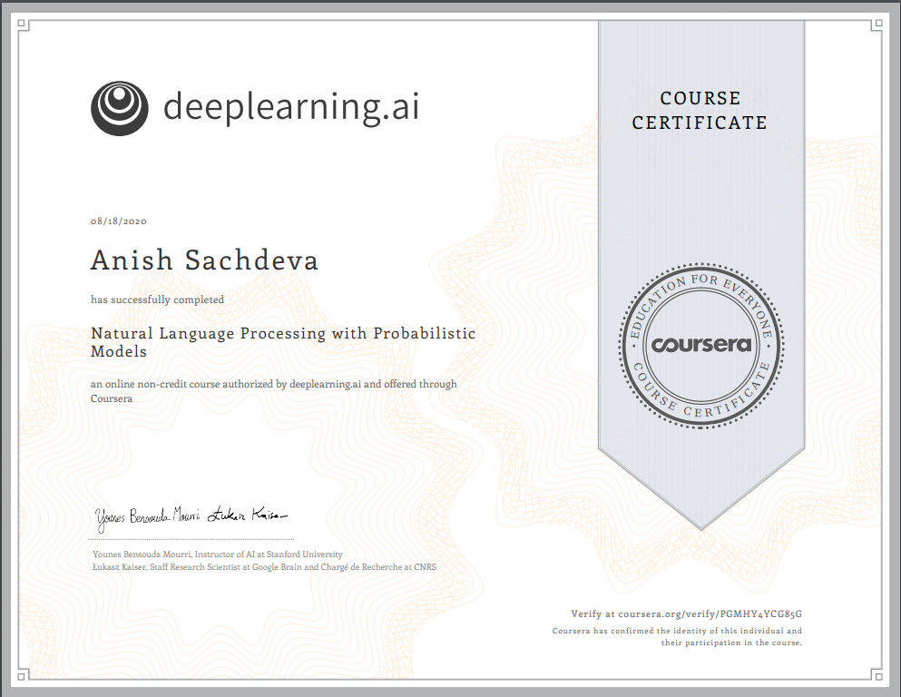

# Natural Language Processing with Probabilistic Models @ Coursera
__~deeplearning.ai__   

## Index
- [Week 1](#week-1)
- [Week 2](#week-2)
- [Week 3](#week-3)
- [Week 4](#week-4)
- [Certificate](#certificate)

## Week 1
- [Lab: Building The Vocabulary](week_1/building-the-vocabulary.ipynb)
- [Lab: Candidates From Edits](week_1/candidates-from-edits.ipynb)
- [Levenshtein Distance Algorithm](week_1/minimum_edit_distance.py)
- [Programming Assignment: Autocorrect](week_1/assignment/auto-correct.ipynb)

## Week 2
- [Lab: Working With Text Data: Creating Vocabulary and Handling Unknown Words](week_2/creating-vocabulary-and-handling-unknown-words.ipynb)
- [Lab: Working With Tags & NumPy](week_2/working-with-tags-and-numpy.ipynb)
- [Programming Assignment: Part of Speech Tagging Using Viterbi Algorithm](week_2/assignment/viterbi-algorithm.ipynb)

## Week 3
- [Lab: Corpus Preprocessing for N-Grams](week_3/n-gram-corpus-preprocessing.ipynb)
- [Lab: Building the Language Model](week_3/building-the-language-model.ipynb)
- [Lab: Out of Vocabulary Words](week_3/out-of-vocabulary-words.ipynb)
- [Programming Assignment: Autocomplete](week_3/assignment/autocomplete-using-n-grams.ipynb)

## Week 4
- [Lab: Data Pre-Processing](week_4/data-pre-processing.ipynb)
- [Lab: Activation Functions](week_4/activation-functions.ipynb)
- [Lab: Training The CBOW (Continuous Bag of Words) Model](week_4/training-the-cbow-model.ipynb)
- [Lab: Word Embeddings](week_4/word-embeddings.ipynb)
- [Lab: Word Embeddings - The Full Pipeline](week_4/word-embeddings-full-pipeline.ipynb)
- [Programming Assignment: Word Embeddings](week_4/assignment-word-embeddings.ipynb)

## Certificate [🎓](https://coursera.org/verify/PGMHY4YCG85G)

